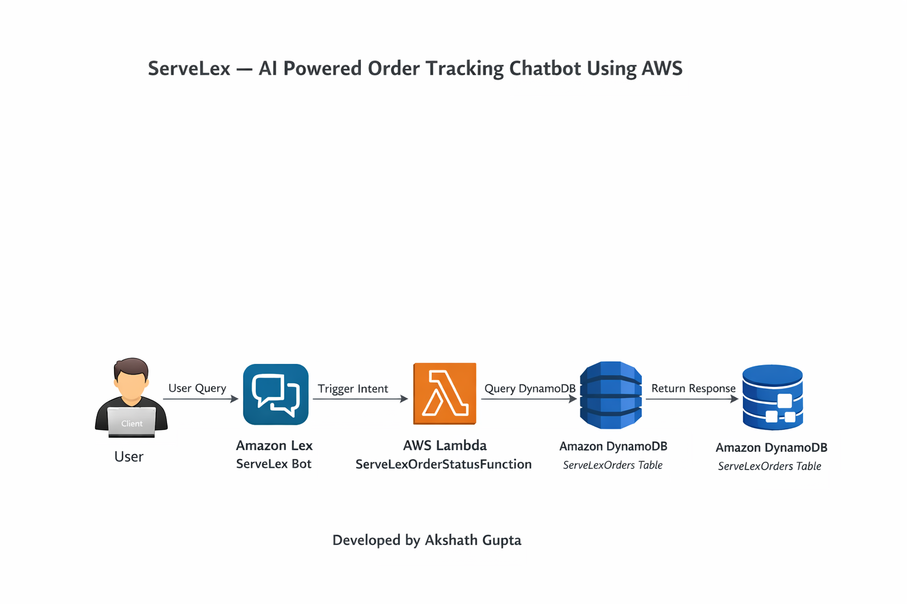

# ServeLex — AI Powered Order Tracking Chatbot Using AWS

An intelligent serverless chatbot that allows users to check their order status using natural language queries.  
ServeLex leverages AWS cloud services to provide a scalable and efficient order tracking solution.

---

## 🚀 Project Overview

ServeLex is a cloud-native chatbot designed to automate order tracking. Users can interact with the chatbot using natural language, and the system retrieves order information in real-time from a cloud database.

The project demonstrates how serverless architecture can be used to build scalable AI-powered customer support systems.

---

## 🛠 Technologies Used

- Amazon Lex — Natural Language Processing Chatbot
- AWS Lambda — Backend serverless logic
- Amazon DynamoDB — NoSQL database for order storage
- AWS IAM — Access control and security

---

## 🏗 System Architecture

User → Amazon Lex → AWS Lambda → DynamoDB → Lambda → Lex → User

Architecture Components:

- **User Interface** — Chat interaction with the bot
- **Amazon Lex** — Processes user input and detects intent
- **AWS Lambda** — Executes backend logic
- **DynamoDB** — Stores order information

---

## 📊 Architecture Diagram

---

## ⚙️ How It Works

1. User sends a message to the chatbot.
2. Amazon Lex identifies the intent and extracts the order ID.
3. AWS Lambda receives the request and processes it.
4. Lambda queries the DynamoDB table.
5. Order details are returned to the user.

---

## 💬 Example Interaction

User Input:
check order 12345
Bot response:
Your order is shipped.Expected delivery is 10 April 2026

---

## ✨ Features

- AI-powered chatbot interface
- Dynamic order ID tracking
- Real-time database lookup
- Fully serverless architecture
- Scalable cloud-based solution

---

## 🔮 Future Improvements

- Multi-language chatbot support
- Voice-based assistant integration
- Authentication system for users
- Integration with real e-commerce platforms
- Web and mobile chatbot interface

---

## 👨‍💻 Author

**Akshath Gupta**

Developed as part of a cloud computing project demonstrating the implementation of AI-driven customer service automation using AWS.

---

## 📚 References

- AWS Documentation
- Amazon Lex Developer Guide
- AWS Lambda Documentation
- Amazon DynamoDB Documentation